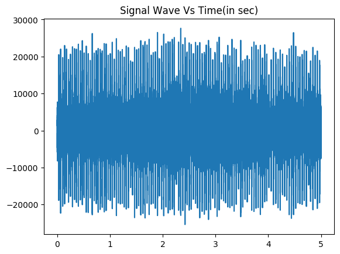

# Sound Classification
It's a repository to do sound classification using different method, including:
- SVM
- Logistic Regression
- Random Forest
- k-nearest neighbors (KNN)
- Multilayer Perceptron
- CNN

# Dataset
[ESC-50](https://github.com/karolpiczak/ESC-50): The dataset consists of 5-second-long recordings organized into 50 semantical classes (with 40 examples per class)

# Quick Start
1. Download the [ESC-50](https://github.com/karolpiczak/ESC-50) dataset manually, and put it in the folder that contains `sound_classfication` project.

2. Plot sound wave, belowing is a waveplot of fire alarm sound：

> python3 visualize_sound.py --wav_file 1-13613-A-37.wav

3. Extract features and save them in `features.csv`:

> python3 extract_features.py

4. Train model:

> python3 main.py --method svm

